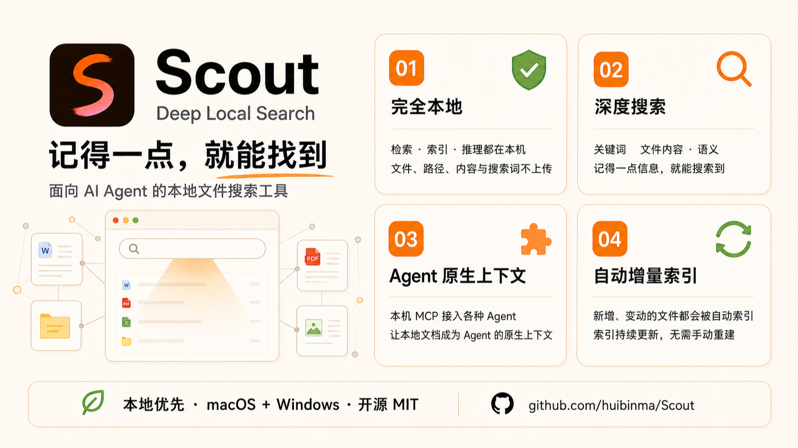

# Scout



**Deep Local Search.** 一个面向 **AI agent** 的本地文件搜索工具——通过 [MCP](https://modelcontextprotocol.io/)（Model Context Protocol）把本地文件的语义检索能力开放给 Claude Code、Codex、Cline 或任何自研 agent 调用；同时也内置跨平台（macOS + Windows）桌面应用，可直接供人用自然语言搜索本机文件。本地优先、开源免费，MIT 许可。

核心形态是 `scoutd`——一个 headless daemon，经 MCP 把自然语言语义检索、关键字文本检索、元数据等文件属性检索暴露为标准工具，供各类 agent 直接调用，适用于团队冷归档、审计取证等场景（agent 代人检索，而非人直接操作）。同一套检索能力也打包成桌面应用，供人直接使用：查找电脑里的文件、文档、音乐、图片、截图——记不清文件名、跨中英文也能找到，无需学习 Spotlight 操作符或 Everything 通配符语法。检索、索引和推理均在本地完成，不上传用户数据；只有用户主动选择一键下载模型时才访问公开模型站点，详见 [PRIVACY.md](./PRIVACY.md)。项目定位与目标场景以 [PROJECT.md](./PROJECT.md) 为准。

---

## 安装

- **Windows**：到 [Releases](https://github.com/huibinma/Scout/releases) 下载 NSIS 安装包。SignPath Foundation 申请获批并完成流水线切换后的新 Release 将带 Authenticode 签名；旧 Release 仍可能未签名，请按 [安装指南](./docs/install.md) 核验。
- **macOS**：到 [Releases](https://github.com/huibinma/Scout/releases) 下载 DMG（仅 Apple Silicon / arm64；未签名未公证，Gatekeeper 提示可能是「未知开发者」也可能是「已损坏」，均用 `xattr -dr com.apple.quarantine` 放行，Intel Mac 请从源码构建）。

SmartScreen / Gatekeeper 放行步骤、SHA256 校验、源码构建、可选模型下载，详见 **[安装指南](./docs/install.md)**。

## Code signing policy

Free code signing provided by [SignPath.io](https://about.signpath.io/), certificate by
[SignPath Foundation](https://signpath.org/)。签名范围、团队角色、隐私边界、发布与核验流程见
[Scout Code signing policy](./CODE_SIGNING.md)。

## 这个仓库是什么

Scout 是一个由 **Claude Code / Codex / Gemini** 三个 AI 工具轮换协作开发的项目。本仓库的文档结构按这一协作模式设计。

### 入口文件（各工具自动读取）

- [CLAUDE.md](./CLAUDE.md) — Claude Code 入口
- [AGENTS.md](./AGENTS.md) — Codex 入口
- [GEMINI.md](./GEMINI.md) — Gemini 入口

三份内容对等，都指向同一份共享上下文。

### 共享上下文（单一信源）

- [PROJECT.md](./PROJECT.md) — 项目目标、定位、架构、阶段路线
- [ROADMAP.md](./ROADMAP.md) — **全程任务级地图：4 阶段任务清单、依赖、估时、出场标准**
- [STATUS.md](./STATUS.md) — **当前阶段、当前 task、下一步、会话日志**
- [CONVENTIONS.md](./CONVENTIONS.md) — 协作规则、收工流程、编码规范

### 详细计划

- [docs/local-personal-search-agent-project-plan.md](./docs/local-personal-search-agent-project-plan.md)
- [docs/Scout知识产权保护计划书.md](./docs/Scout知识产权保护计划书.md)（历史记录：商标/域名/签名部分已随 2026-07-04 开源免费定位取消）
- [docs/Scout项目注意事项与风险清单.md](./docs/Scout项目注意事项与风险清单.md)

## 仓库结构

```text
Scout/
├── PROJECT.md / ROADMAP.md / STATUS.md / CONVENTIONS.md   共享上下文
├── CLAUDE.md / AGENTS.md / GEMINI.md           三工具入口
├── docs/                                       详细计划与设计文档
├── apps/
│   ├── desktop/                                Tauri 跨平台桌面应用
│   ├── daemon/                                 scoutd：headless MCP 检索服务（团队归档）
│   └── scout-cli/                           CLI 入口
├── packages/
│   ├── harness/                                Agent Harness
│   ├── intent-parser/                          自然语言 → Search Intent JSON
│   ├── search-backends/
│   │   ├── common/                             SearchBackend trait + 归一化结果
│   │   ├── spotlight/                          macOS（mdfind / NSMetadataQuery）
│   │   ├── windows-search/                     Windows（OLE DB SystemIndex）
│   │   ├── everything/                         Windows 可选加速（ES / SDK）
│   │   ├── local-index/                        自建本地索引后端（音乐/文档/图片 OCR）
│   │   └── semantic-index/                     语义召回后端（embedding hybrid）
│   ├── scout-server/                        daemon 服务层（MCP adapter + auth + tools）
│   ├── result-normalizer/
│   ├── ranker/
│   ├── indexer/                                SQLite + FTS5 + 向量索引
│   ├── model-runtime/                          llama.cpp 集成
│   ├── spike-retrieval/                        语义检索探针（BETA-26）
│   └── evals/
├── platform/
│   ├── macos/                                  Spotlight FFI
│   └── windows/                                WinRT/OLE DB binding
├── scripts/
└── tests/
```

## 当前阶段

见 [STATUS.md](./STATUS.md) 顶部。

## 协作约定（极简版）

- **会话开始**：当前工具按顺序读 PROJECT.md → STATUS.md → CONVENTIONS.md，再按需定向读 ROADMAP.md（详见 [CONVENTIONS §2](./CONVENTIONS.md)），然后动手。
- **会话结束**：用户说"**收工**" → 当前工具同步 STATUS.md + ROADMAP.md（task 状态）+ git commit。
- 单一信源、相对路径、中文沟通、英文标识符 —— 详见 [CONVENTIONS.md](./CONVENTIONS.md)。
- **新 clone 一次性设置**：`git config core.hooksPath scripts/hooks`（启用文档体积闸门 pre-commit hook，详 [CONVENTIONS §3](./CONVENTIONS.md)）。

## License

本项目采用 **MIT 许可**：

- [LICENSE-MIT](./LICENSE-MIT)

除非你明确声明，你有意提交给本项目的任何贡献均按上述许可授权，无附加条款。第三方依赖授权清单见 [docs/third-party-licenses.md](./docs/third-party-licenses.md)。

## 隐私

本地优先：文件名、路径、内容、搜索词、索引数据全部留在本机，无遥测、默认不联网。详见 [PRIVACY.md](./PRIVACY.md)。

## 贡献

欢迎 issue 与 PR——开发环境、验证闸门、双许可贡献条款见 [CONTRIBUTING.md](./CONTRIBUTING.md)。安全漏洞请走 GitHub Security Advisories 私下报告。
